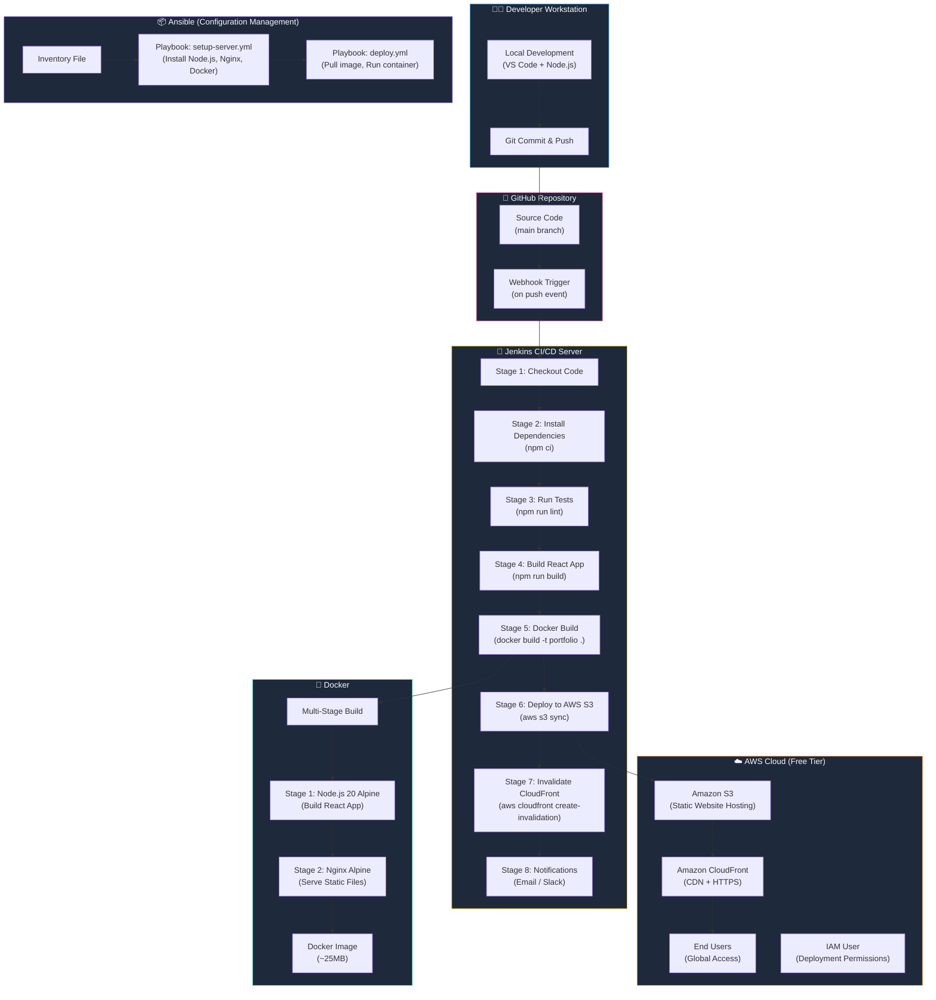
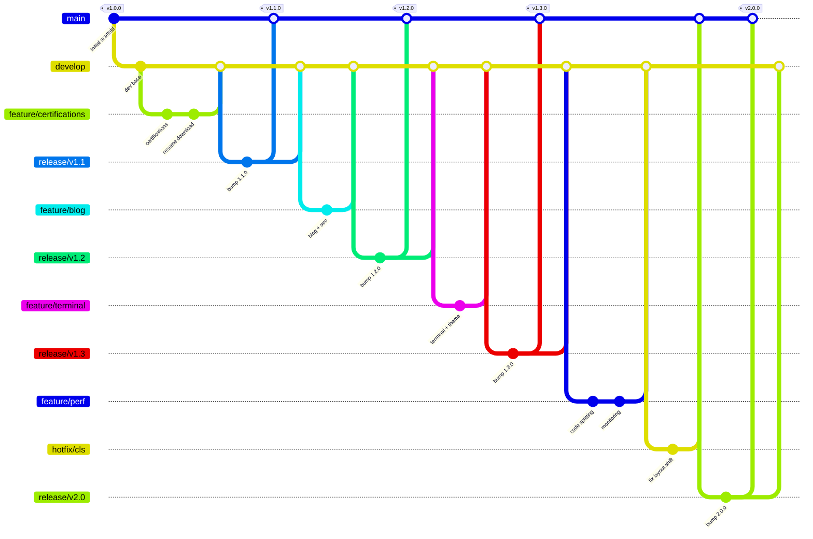
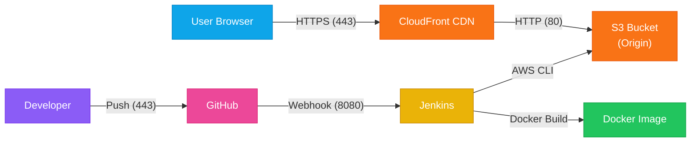

# Architecture Overview

This document explains the complete CI/CD architecture and how all DevOps tools are integrated in this project.

## System Architecture Diagram

## Tool Integration Matrix

| Tool | Role | How It Fits |
|------|------|-------------|
| **GitHub** | Source Code Management | Hosts the repository, triggers Jenkins via webhook on push |
| **Jenkins** | CI/CD Orchestrator | Automates build, test, containerize, and deploy pipeline |
| **Docker** | Containerization | Packages the app into a portable, reproducible container image |
| **AWS S3** | Static Hosting | Stores the production build files for serving |
| **AWS CloudFront** | CDN & HTTPS | Distributes content globally with SSL/TLS encryption |
| **AWS IAM** | Security | Provides least-privilege access for Jenkins to deploy |
| **Ansible** | Configuration Management | Automates server provisioning and app deployment |

## CI/CD Pipeline Flow (Step-by-Step)

### 1. Developer Pushes Code → GitHub
- Developer writes code locally, runs `git commit` and `git push`
- Code is pushed to the `main` branch on GitHub
- GitHub webhook notifies Jenkins of the new commit

### 2. Jenkins Pipeline Triggers Automatically
- Jenkins receives the webhook and starts the pipeline defined in `Jenkinsfile`
- The pipeline runs through 8 stages sequentially

### 3. Build & Test Phase
- **Checkout**: Jenkins clones the latest code from GitHub
- **Install**: Runs `npm ci` for deterministic dependency installation
- **Test**: Runs `npm run lint` to check code quality
- **Build**: Runs `npm run build` to create optimized production files in `dist/`

### 4. Containerization Phase
- **Docker Build**: Creates a multi-stage Docker image
  - Stage 1 (Builder): Uses Node.js to build the React app
  - Stage 2 (Production): Uses Nginx to serve the static files
- Result: A lightweight (~25MB) production-ready container

### 5. Deployment Phase
- **S3 Deploy**: Uses AWS CLI to sync `dist/` files to the S3 bucket
- **CloudFront Invalidation**: Clears the CDN cache so users see the latest version
- **Notifications**: Sends success/failure alerts via Email or Slack

### 6. Ansible (Server Configuration)
- Used when deploying to EC2 instances instead of S3
- Automates: Installing Docker, pulling the image, running the container
- Ensures consistent server configuration across environments

## Branching Strategy

| Branch | Purpose | Base | Merges Into |
|--------|---------|------|-------------|
| `main` | Production-ready, tagged releases | — | — |
| `develop` | Integration branch | `main` | `main` (via release) |
| `feature/*` | New feature development | `develop` | `develop` |
| `release/*` | Release prep (version bump, tag) | `develop` | `main` + `develop` |
| `hotfix/*` | Urgent production fixes | `main` | `main` + `develop` |

## Network Architecture

