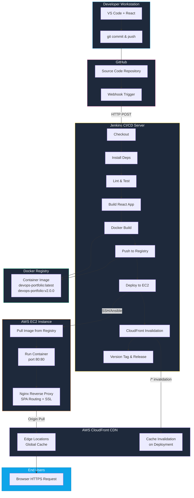
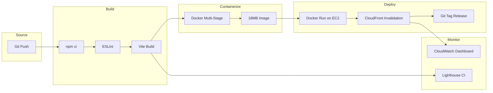
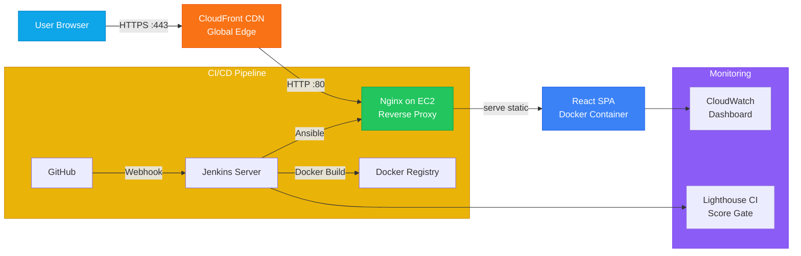
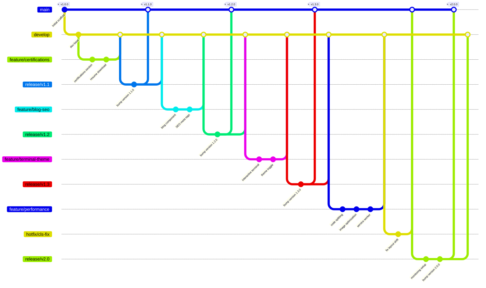

# Deployment Architecture Diagrams

## End-to-End CI/CD Pipeline



---

## CI/CD Stages Flow



---

## Network Architecture



---

## Git Branching Strategy



---

## Branch Naming Convention

| Branch Pattern | Purpose | Merges Into |
|----------------|---------|-------------|
| `main` | Production-ready code | — |
| `develop` | Integration branch | `main` (via release) |
| `feature/*` | New features | `develop` |
| `release/*` | Release preparation | `main`, `develop` |
| `hotfix/*` | Urgent production fixes | `main`, `develop` |

---

## Deployment Flow (Text)

```
Git Push (feature/*)
      │
      ▼
Pull Request → develop
      │
      ▼
Git Flow Release Branch (release/x.x)
      │
      ▼
Jenkins Pipeline Triggered
      │
      ├── 1. Checkout Code
      ├── 2. npm ci (install dependencies)
      ├── 3. npm run lint (code quality)
      ├── 4. npm run build (Vite production build)
      ├── 5. docker build (multi-stage)
      ├── 6. Deploy to EC2 (Ansible/Docker)
      ├── 7. Invalidate CloudFront Cache
      └── 8. Tag release (vX.X.X)
      │
      ▼
Git Tag pushed → Release created on GitHub
      │
      ▼
Production Live on CloudFront + EC2
```
